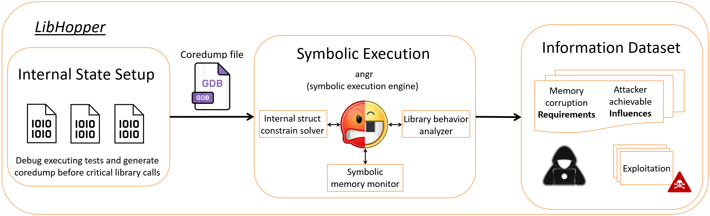

# libhopper

LibHopper is an exploitation primitives finding framework for arbitrary user libraries.

## Introduction

User libraries commonly maintain their own internal state structures, known as *library internal state* structures or simply *internal structs*, to facilitate various functionalities, such as encapsulation, modularity, data integrity, and performance optimization. While these internal structs serve essential purposes in ensuring the proper functioning of the library, they also introduce potential vulnerabilities that attackers can exploit to gain unauthorized control over the program's execution flow.

One well-known instance of such exploitation is the `FILE` struct attack based on the internal struct maintained by the GNU C Library (glibc). By meticulously crafting data within the internal state, attackers can achieve a variety of malicious outcomes, including arbitrary write, arbitrary read, and even remote code execution privileges. This attack vector underscores the critical importance of understanding and securing library internal structs to prevent malicious manipulation of program behavior.

One of the challenges in securing user libraries against such attacks lies in the difficulty of automated bug-finding and testing. Similar to the complexities encountered in fuzzing user libraries, the APIs provided by these libraries must be invoked in a specific order, as defined by the library itself, to properly handle the internal state and ensure reliable operation. This intricate relationship between the user's interaction with the library and its internal struct makes it arduous to identify and mitigate vulnerabilities through automated means.

To address the need for exploring potential exploitation primitives inherent in library internal structures, we introduce **LibHopper**, a novel framework designed for automated exploitability analysis of user library internal states in the presence of memory corruption. LibHopper assumes that an attacker can carry out a subset of potential memory corruptions, and it leverages customized GDB helper scripts and symbolic execution techniques to identify achievable exploitation primitives. By simulating various memory corruption scenarios, LibHopper can effectively assess the security posture of a user library, helping developers identify critical vulnerabilities and implement appropriate security measures.

## Library Internal State Structures

The term *library internal state structures* or *internal struct* refers to customized data structures within a library developed using the C/C++ programming language. These internal structs play a crucial role in representing and managing the state of data that is processed by the user library. Unlike public interfaces exposed by the library, internal structs are not meant to be accessed or manipulated directly by external users or applications. Instead, they serve as the backbone of the library's implementation, encapsulating the necessary data and metadata required for efficient and seamless functioning.

Internal structs are an essential component of a well-designed library, contributing to its overall stability, security, and maintainability. By providing a structured way to organize and manage data, they help prevent unnecessary exposure of sensitive information to the outside world and shield the library's implementation details from external interference. This encapsulation is a fundamental principle of object-oriented programming, promoting data abstraction and information hiding.

### Motivating Example: `FILE` Struct

In the realm of C/C++ programming, the `FILE` struct plays a pivotal role in handling file I/O operations. Source code can be found [here](https://elixir.bootlin.com/glibc/glibc-2.37/source/libio/bits/types/struct_FILE.h#L49). It serves as a fundamental component of the C Standard Library, allowing programmers to read from and write to files on the system. The `FILE` struct encapsulates essential information about the file, including its file descriptor, read/write status, buffer details, and the current position indicator.

The primary purpose of the `FILE` struct is to facilitate seamless communication between a program and the files it interacts with. When a program opens a file, the operating system assigns a unique file descriptor to represent that specific file in the program's execution. The `FILE` struct acts as a crucial intermediary between the program and the file descriptor, managing the data buffering, ensuring efficient data transfers, and tracking the current read and write positions.

Additionally, the `FILE` struct maintains essential attributes related to file access modes, error indicators, and end-of-file markers. By encapsulating this information, it shields the complexities of file handling from the programmer, enabling a higher level of abstraction and ease of use when working with files.

### Exploiting `FILE` Struct

Despite its vital role in file I/O, the `FILE` struct has been a recurring target for exploitation due to its inherent complexities and potential vulnerabilities. The source of `FILE` struct exploit can be found [here](https://www.slideshare.net/AngelBoy1/play-with-file-structure-yet-another-binary-exploit-technique).

This type of vulnerability arises when a program mishandles a `FILE` pointer or fails to validate user input properly. An attacker can leverage this weakness to manipulate the `FILE` struct and perform unauthorized operations on files, leading to various security risks. Some common methods of exploiting the `FILE` struct include:

- Arbitrary File Read/Write
- Denial-of-Service (DoS)
- File Traversal
- Code Execution

## LibHopper Overview

LibHopper's goal is to evaluate the exploitability of the internal struct in any given user library. By automating the process of exploitability analysis, LibHopper empowers security researchers and developers to comprehensively assess the security implications associated with memory corruption vulnerabilities within library internal structures.

At its core, LibHopper utilizes a multi-faceted approach, combining customized GDB (GNU Debugger) helper scripts and symbolic execution techniques to achieve its exploitability analysis. The framework operates under the assumption that an attacker can execute a subset of potential memory corruptions on the library's internal structs.

- Memory Corruption Scenarios: LibHopper simulates a range of effects of memory corruption scenarios, encompassing various types of common vulnerabilities like buffer overflows, use-after-free, and format string vulnerabilities. These scenarios represent typical attack vectors employed by adversaries to manipulate internal data structures. Conclude it into 3 basic memory corruption: overflow, arbitrary write, full write.

- GDB Helper Scripts: To automate the execution process, LibHopper employs custom GDB helper scripts that interact with the debugger during the debugging phase. These scripts facilitate the examination of internal struct states at different points of program execution, enabling dynamic inspection of the library's behavior as it processes data. GDB scripts will dump out core files which will then feed into the symbolic execution engine: `angr`

- Symbolic Execution: Leveraging symbolic execution techniques, LibHopper explores potential execution paths and data flows within the library when subjected to memory corruption. Symbolic execution allows the framework to analyze the impact of corruption on the library's internal structs without relying solely on concrete inputs.

- Exploitation Primitives Identification: Based on the analysis of memory corruption scenarios and symbolic execution results, LibHopper identifies achievable exploitation primitive datasets within the library's internal state. These datasets represent specific weaknesses or vulnerabilities that could be exploited by attackers to compromise the library's integrity or gain unauthorized access.

## Test Results

TODO

## Possiable Future Work

- Based on the current analyzation on library internal structs, push further on the defense side of the library part. How can we better help library developers to defense vuln/attack like this? What about automated tools to enhance the defense with some canary-like data (probably insert those data into the spare space used for data alignment) in the struct and where should we make such guard?

- Based on the current analyzation on library internal structs, push further directly on the attacking part. Integrate with some other tools to make AEG (Automate Exploit Generation). What real app that is vulnerable?

- Dig in the analyzation part, push further on more advanced exploit primitives on library internal structs. Currently we only analyze the library exploit primitives on **intended** usage (if the function with the original data in it, what primitives we have) with some control over the internal struct. There are more to dig in to perform a more deep ["data-oriented attacks"](https://www.google.com/search?q=data+oriented+attacks&oq=data+oriented+attacks&aqs=chrome..69i57.581j0j1&sourceid=chrome&ie=UTF-8) on controlling the whole library of those **unintended** usage (what if we corrupt some data, make the decision tree goes into another branch and trigger other behavior and unlock other primitives? What if there is a loop outside and with multiple corruption with restricted primitives, can we perform a possible attack).
